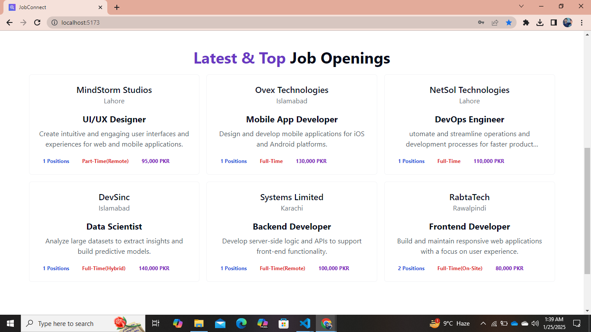
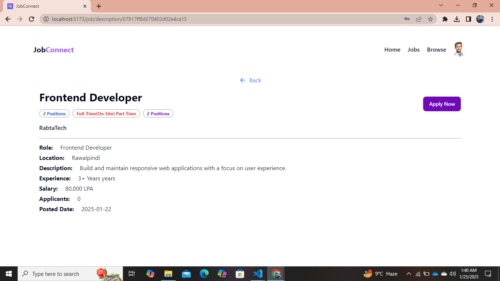
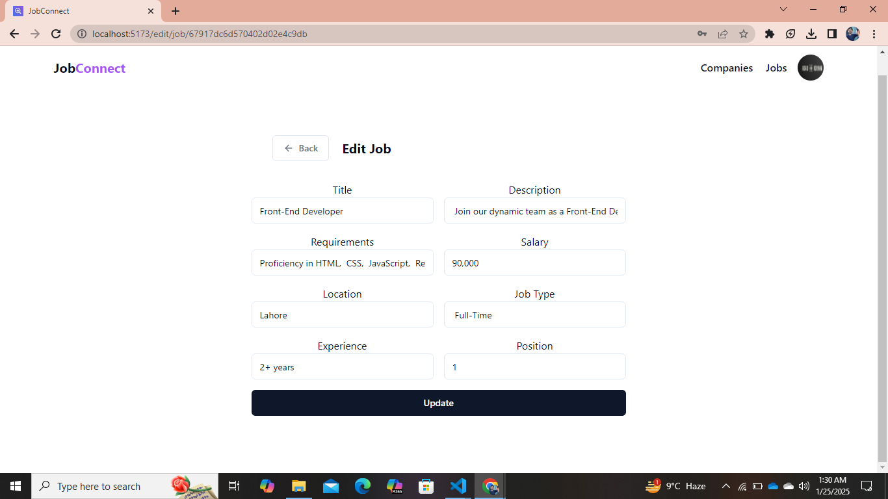

# MERN JobConnect

A full-stack, real-time job posting web application built on the MERN stack (MongoDB, Express, React, Node.js). This platform connects **students** and **recruiters**, providing an efficient way for job seekers to apply for jobs and for recruiters to manage applications dynamically.

---

## 🚀 Features

### Recruiter Features:
- **Register Companies:** A recruiter can register one or multiple companies.
- **Post Jobs:** Create job postings under any registered company.
- **Manage Applications:**  
  - View a list of applicants for each job, along with their relevant details and resumes.  
  - Accept or reject applications in real time, dynamically updating the student's application status.
- **Edit Details:** Update company information or job descriptions.

### Student Features:
- **Browse Jobs:** Explore all jobs posted by recruiters.
- **Search and Filter:** Find jobs based on:
  - Salary
  - Location
  - Role
  - Custom keyword search
- **Apply for Jobs:** Submit applications for jobs and track their status in real time.
- **Application Tracking:** View the total number of jobs applied for and their statuses (e.g., Accepted, Rejected, Pending).

### Real-Time Updates:
- Job postings, applications, and status updates happen dynamically without refreshing the page.

---

## 🛠️ Tech Stack

- **Frontend:** React, Vite, Redux Toolkit, ShadCN UI, Framer Motion  
- **Backend:** Node.js, Express.js  
- **Database:** MongoDB  
- **File Uploads:** Multer + Cloudinary  
- **State Management:** Redux Toolkit  

---

## 📂 Folder Structure
. ├── backend │ ├── controllers │ ├── models │ ├── middleware │ ├── routes │ ├── server.js │ └── config ├── frontend │ ├── src │ │ ├── components │ │ ├── pages │ │ ├── hooks │ │ ├── store │ │ └── App.jsx └── README.md


---

## 📸 Screenshots

### Login/Signup Screenshots

  

### Student Section Screenshots

     

### Recruiter Section Screenshots
These are the screenshots showing the Recruiter section (displayed in a single row):

   
   


---

## View Live Demo  👇

<a href="https://jobconnect-fullstack.onrender.com/" target="_blank">🔗 Live Demo</a>

---

## ⏱️ Development Timeline (Key Highlights)

1. **Backend Setup**
   - Connected MongoDB, created models, and implemented controllers for users, companies, jobs, and applications.  
   - API routes and middleware for security and validation.  

2. **Frontend Development**
   - React and Vite setup with Redux Toolkit for state management.  
   - Built dynamic pages like Home, Login/Signup, Jobs, User Profile, and Admin Dashboard.  

3. **File Uploads and Cloudinary Integration**
   - Set up **Multer** for handling file uploads on the backend.  
   - Integrated **Cloudinary** for secure and efficient file storage for resumes and images.  

---

## 🧑‍💻 Getting Started

### Prerequisites:
- Node.js installed
- MongoDB set up locally or using a cloud service (e.g., MongoDB Atlas)
- A Cloudinary account for file storage

 **Clone the Repository** 
 
   ```bash
   git clone https://github.com/AsadKhan911/JobConnect_FullStack.git

